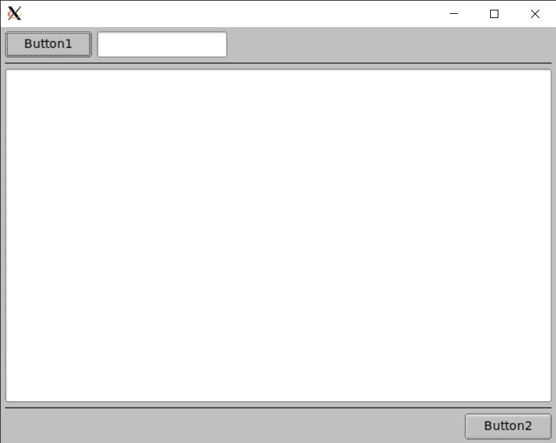

# fltk-flow

A crate wrapping [Fl_Flow](https://github.com/osen/Fl_Flow). This uses a native module written in C++, so it won't work with the fltk-bundled feature.

## Example:
```rust
#![allow(unused_mut)]

use fltk::{prelude::*, enums::*, *};
use fltk_flow::Flow;

fn main() {
    let a = app::App::default().with_scheme(app::Scheme::Gtk);

    let mut win = window::Window::default().with_size(640, 480);
    let mut flow = Flow::default_fill();
    let btn = button::Button::default().with_size(100, 30).with_label("Button1");
    let inp = input::Input::default().with_size(150, 30);
    let mut sep = frame::Frame::default().with_size(10, 1);
    let area = input::MultilineInput::default().with_size(10, 10);
    let mut sep2 = frame::Frame::default().with_size(10, 1);
    let btn2 = button::Button::default().with_size(100, 30).with_label("Button2");
    flow.end();
    win.end();
    win.resizable(&flow);
    win.show();
    
    sep.set_color(Color::Black);
    sep.set_frame(FrameType::FlatBox);
    sep2.set_color(Color::Black);
    sep2.set_frame(FrameType::FlatBox);

    flow.rule(&btn, "^<");
    flow.rule(&inp, "^<");
    flow.rule(&sep, "=<^");
    flow.rule(&area, "<^");
    flow.rule(&sep2, "=<^");
    flow.rule(&btn2, "v");
    flow.rule(&sep2, "v");
    flow.rule(&area, "=>=v");

    a.run().unwrap();
}
```

